CuTe is the layout and tensor vocabulary inside CUTLASS. It describes data, thread layouts,
tiles, and partitions so kernels can use logical coordinates while CuTe handles the linear
indexing.

CuTe is built around a few small ideas for describing multidimensional things:

```text
Shape   = the logical coordinate space of a multidimensional thing, usually a data tensor
Layout  = the rule that maps those coordinates to linear offsets
Tensor  = pointer to data + layout
```

A CuTe `Layout` is the coordinate-to-offset rule. It lets code name a coordinate in a
multidimensional logical space and then ask:

```text
Which linear offset does this coordinate map to?
```

Conceptually:

```text
input coordinate -> Layout -> offset corresponding to the input coordinate
```

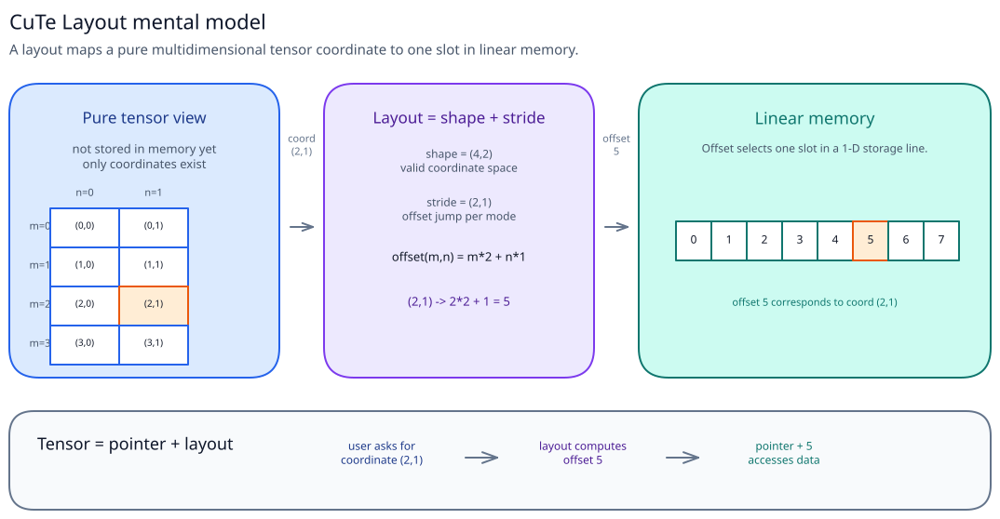

A `Layout` separates the logical view of a multidimensional tensor from the physical
arrangement of its elements in 1D memory. Code can work with tensor coordinates without
needing to know whether the elements are stored row-major, column-major, or in some other
layout.

---

## Layout Basics

In CuTe, a `Layout` is a combination of a `Shape` and a `Stride`. The shape describes the
multidimensional coordinate space. The stride describes how a unit change in one coordinate
changes the linear offset.

### Shape

Before talking about offsets, start with the coordinate space.

For a `4 x 8` matrix, the shape is:

```text
(4,8)
```

That means valid coordinates look like:

```text
(0,0) ... (3,7)
```

The shape does not say where those coordinates live in memory. It only says which coordinates
exist.

```text
Shape = valid logical coordinates
```

To map those coordinates to offsets, we need a layout.

---

### Layout

CuTe represents a layout as:

```text
Layout = Shape + Stride
```

CuTe usually prints this in compact form:

```text
shape:stride
```

For example:

```text
(4,8):(8,1)
```

Read this as:

```text
shape  = (4,8)
stride = (8,1)
```

The shape tells us which coordinates are valid. The stride tells us how much the linear offset
changes when we move by one step along each mode.

For a rank-2 layout:

```text
shape  = (M, N)
stride = (stride_m, stride_n)
```

the offset is:

```text
offset(m, n) = m * stride_m + n * stride_n
```

So:

```text
(4,8):(8,1)
```

means:

```text
offset(m, n) = m * 8 + n * 1
```

Moving one step in `m` jumps by `8`. Moving one step in `n` jumps by `1`.

---

### Row-Major And Column-Major

The same shape can use different strides.

For a `4 x 2` matrix, row-major layout is:

```text
shape  = (4,2)
stride = (2,1)

0  1
2  3
4  5
6  7
```

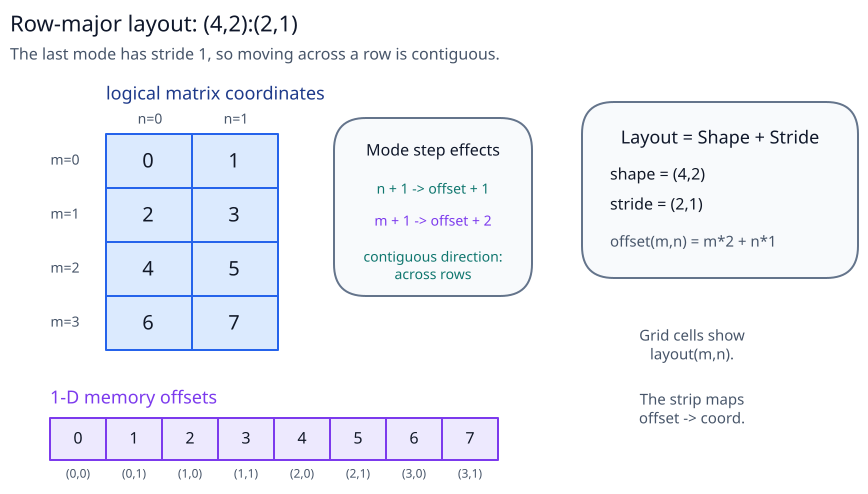

The offset formula is:

```text
offset(m, n) = m * 2 + n * 1
```

The second mode has stride `1`, so moving across a row is contiguous.

Column-major layout keeps the same shape but changes the stride:

```text
shape  = (4,2)
stride = (1,4)

0  4
1  5
2  6
3  7
```

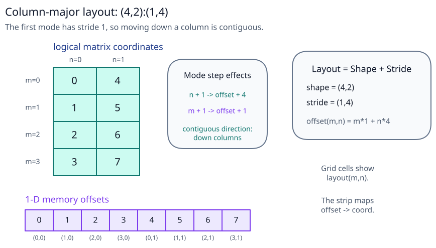

The offset formula is:

```text
offset(m, n) = m * 1 + n * 4
```

The first mode has stride `1`, so moving down a column is contiguous.

---

### Static And Dynamic Values

CuTe layouts often contain both compile-time and runtime values.

In printouts and examples, static values are written with an underscore:

```text
_4       compile-time 4
4        runtime or ordinary 4
(_4, 8)  mixed static and dynamic shape
```

For reading a layout, `_4` and `4` represent the same value. The difference matters to C++:
static values let the compiler specialize code, unroll loops, and simplify layout arithmetic.

You may see code like:

```cpp
// make_layout takes a shape and a stride.
auto row = make_layout(make_shape(_4{}, _2{}), LayoutRight{}); // row-major: rightmost mode stride 1
auto col = make_layout(make_shape(_4{}, _2{}), LayoutLeft{});  // column-major: leftmost mode stride 1
```

Conceptually, those are:

```text
row -> (_4,_2):(_2,_1)
col -> (_4,_2):(_1,_4)
```

---

### Parentheses Matter

CuTe shapes can be nested:

```text
((2,2),8)
```

Do not read this as just another way to write `(4,8)`. Both have `32` elements, but the nested
shape preserves extra structure:

```text
(4,8)      -> two modes
((2,2),8)  -> two modes, where the first mode is factored as (2,2)
```

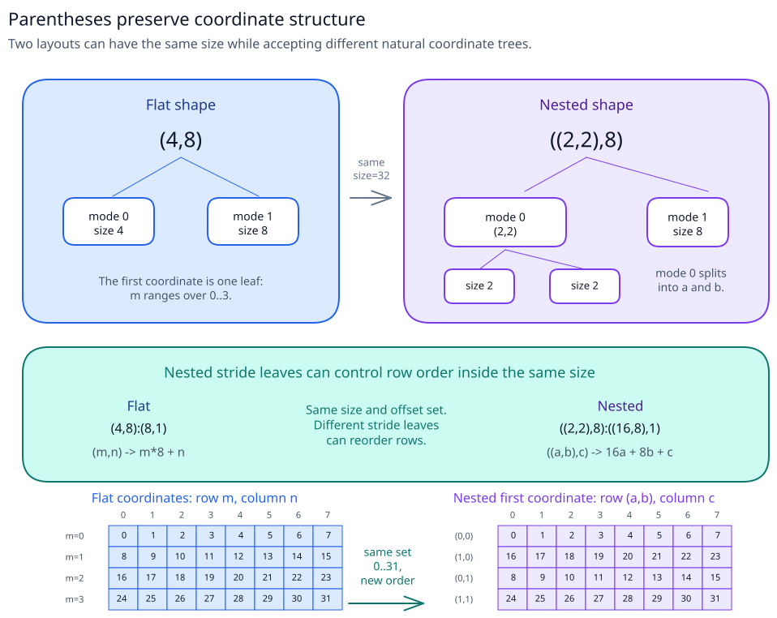

Nested layouts use the same `shape:stride` idea:

```text
shape  = ((2,2),8)
stride = ((16,8),1)
layout = ((2,2),8):((16,8),1)
```

The shape and stride have the same parentheses. Each coordinate piece has one matching stride
piece. For an input natural coordinate `((a,b), c)`, the offset is:

```text
offset = a * 16 + b * 8 + c * 1
```

This is the same 32-element logical space as `(4,8)`, but the first mode has been split into
two leaves. That extra structure lets the nested stride choose how those row groups are ordered.

---

### Size And Cosize

`size` and `cosize` answer two different questions.

```text
size(layout)   = how many logical elements are in the layout
cosize(layout) = largest linear offset produced by the layout + 1
```

You can read `cosize` as how many linear offset positions the layout consumes, including any
gaps between produced offsets.
When those offsets are memory offsets, `cosize` helps determine the size of the backing memory
allocation.

For a dense contiguous layout:

```text
8:1
```

there are `8` logical elements. The valid coordinates are `0..7`, and the produced offsets are
also `0..7`. The largest produced offset is `7`, so `cosize = 7 + 1 = 8`.

```text
size   = 8
cosize = 8
```

For a strided layout:

```text
8:2
```

there are still `8` logical elements, so `size = 8`. The valid coordinates are still `0..7`,
but the produced offsets are:

```text
0, 2, 4, 6, 8, 10, 12, 14
```

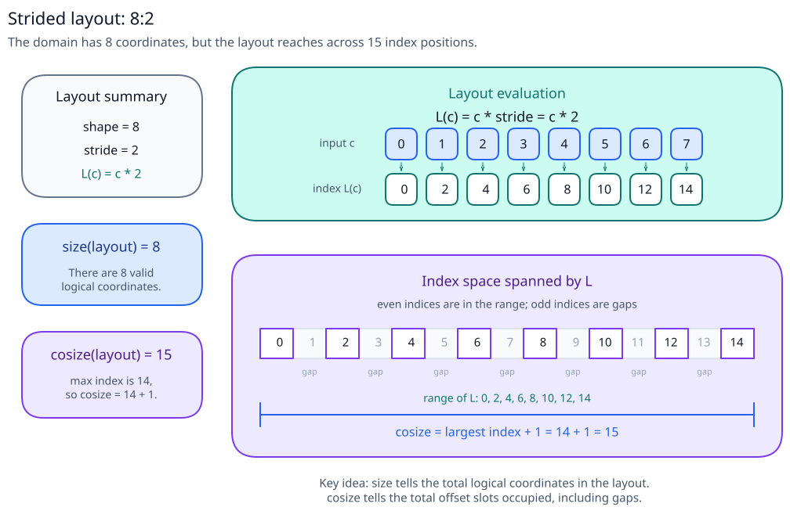

So:

```text
size   = 8
cosize = 15
```

The largest produced offset is `14`, so `cosize = 14 + 1 = 15`.

Mental model:

```text
size tells you how many logical elements the layout has.
cosize tells you how much 1D offset space is needed to cover the largest produced offset.
```

---

### Input Coordinates

A natural coordinate is an input coordinate whose structure matches the structure of the
layout's shape.

For:

```text
shape = (3,(2,3))
```

the natural coordinate looks like:

```text
(i,(j,k))
```

CuTe can also accept input coordinates with less structure, as long as they identify an
element in the same coordinate space. For this shape, all of these refer to the same element:

```text
1-D coordinate:      16
partly split coord:  (1,5)
natural coordinate:  (1,(1,2))
```

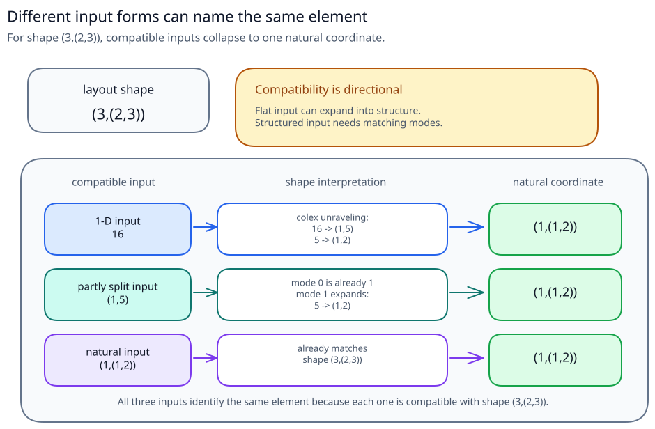

A CuTe layout is not limited to one coordinate syntax. It may accept a flat coordinate, a
partly split coordinate, or a fully nested coordinate, as long as that coordinate is compatible
with the layout's shape.

---

### Compatible Input Coordinates

Compatibility answers:

```text
Can this input coordinate index this layout?
```

Think of it as:

```text
compatible(coord, layout_shape)
```

A compatible input coordinate can be translated cleanly into the layout's natural coordinate,
and its values must be in range.

For a layout with shape `S`, the rule is recursive:

```text
1. If coord is a number c:
   it is compatible when 0 <= c < size(S).
   This is the flat-coordinate case.

2. If coord is a tuple and S is a tuple:
   coord and S must have the same number of top-level modes,
   and each coordinate mode must be compatible with the matching shape mode
   by the same recursive definition.
```

The tuple case is what lets an input coordinate be partially split. CuTe translates each input
mode into the matching natural mode, but it does not split one natural mode across unrelated
input modes.

Examples:

```text
coord = 16
shape = (4,6)
```

This is compatible because `0 <= 16 < size((4,6))`. CuTe can expand the flat coordinate into a
natural `(m,n)` coordinate.

```text
coord = (3,5)
shape = ((2,2),6)
```

This is compatible because the top-level ranks match. Then check each mode recursively:

```text
3 is compatible with (2,2)    because 0 <= 3 < size((2,2))
5 is compatible with 6        because 0 <= 5 < size(6)
```

So the whole coordinate is compatible.

```text
coord = (1, 5)
shape = (3,(2,3))
```

This is compatible. The first mode `1` indexes shape `3`, and the second mode `5` is a flat
coordinate into shape `(2,3)`.

Compatibility is directional:

```text
coord = 5    can index shape (2,3)
coord = (1,2) cannot index shape 6
```

The first case starts flat and expands into structure. The second asks a structured coordinate
to index a layout shape with no structure to match.

---

### Coordinate To Offset Computation

A layout does not jump directly from an arbitrary input coordinate to an offset. It uses a
two-step pipeline:

```text
input coordinate
  -> coordinate mapping using the Shape
  -> natural coordinate
  -> index mapping using the Stride
  -> linear offset
```

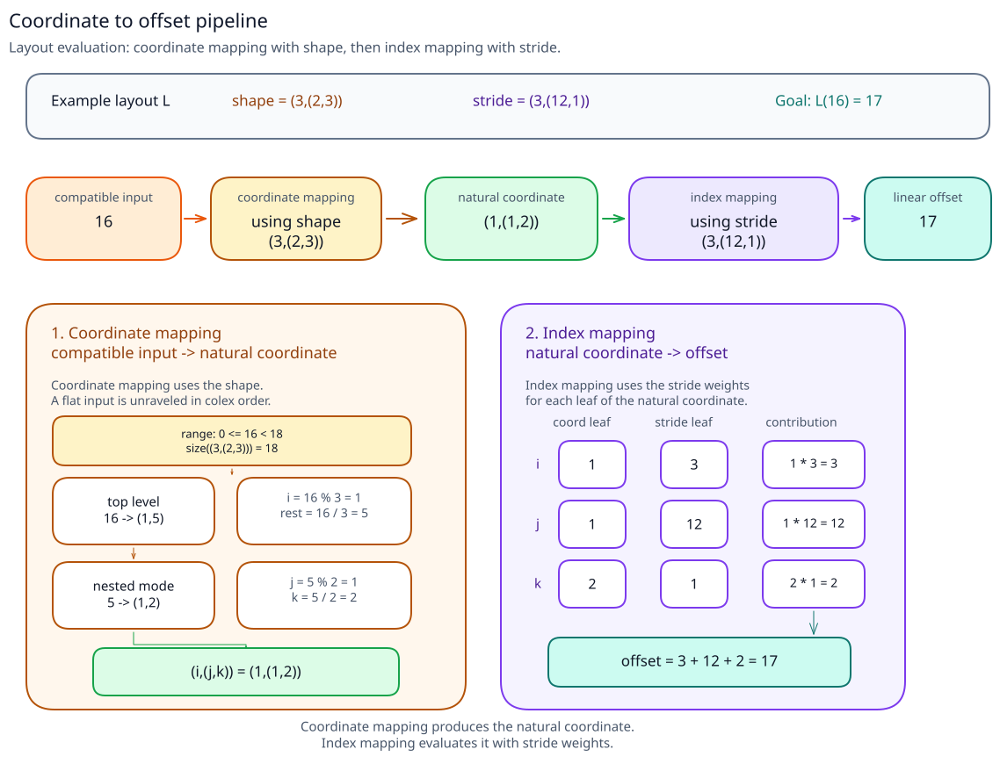

For layout:

```text
(3,(2,3)):(3,(12,1))
```

the compatible input coordinates:

```text
16
(1,5)
(1,(1,2))
```

all convert to the same natural coordinate:

```text
(1,(1,2))
```

#### Coordinate Mapping

Coordinate mapping uses the shape. Its job is to turn any compatible input coordinate into the
natural coordinate.

If the input coordinate is flat, CuTe unravels it in colexicographic order, which is
column-major-style order: the first mode varies fastest. For shape `(3,(2,3))`:

```text
16
  -> 16 % 3 = 1, 16 / 3 = 5
  -> (1, 5)
  -> (1, (5 % 2, 5 / 2))
  -> (1, (1, 2))
```

If the input coordinate is already a tuple, CuTe matches the top-level modes and recurses on
each mode until it reaches a flat coordinate for a leaf shape:

```text
(1,5)
  -> first mode:  1 maps to 1
  -> second mode: 5 maps to (1,2)
  -> (1,(1,2))
```

#### Index Mapping

Index mapping uses the stride. Once CuTe has the natural coordinate, it matches the coordinate
and stride leaf by leaf:

```text
offset = 1 * 3 + 1 * 12 + 2 * 1 = 17
```

---

## Layout Algebra

CuTe defines its own algebra over layouts, similar in spirit to ordinary algebra over numbers.
In ordinary algebra, operations like addition, multiplication, and function composition let us
build larger expressions from smaller ones.

CuTe does the same thing, but the objects are layouts:

```text
composition
product
divide
tiling
partitioning
```

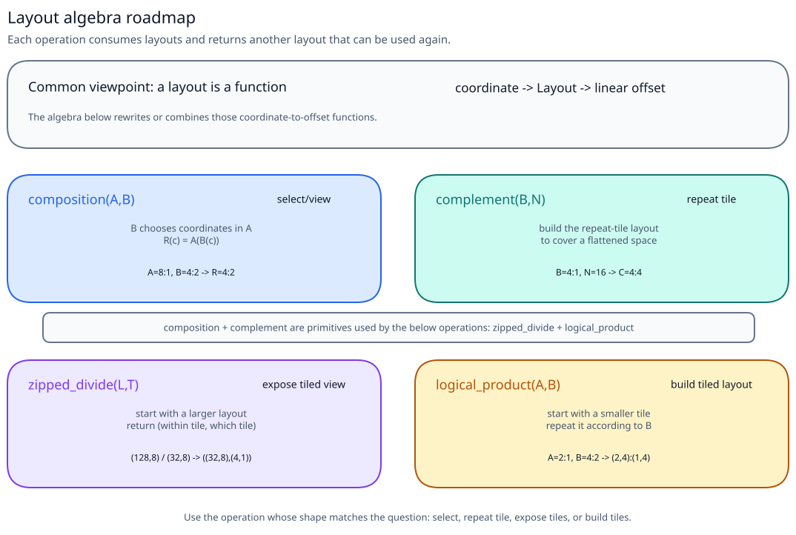

The important idea is that these operations produce another `Layout`. The result can be used
anywhere a normal layout is expected.

Composition is the best place to start because many higher-level CuTe operations are built on
top of it.

### Layouts As Functions

A layout can be viewed as a function from integer to integer. A flat coordinate `c` is a valid
input when `0 <= c < size(layout)`, and the layout always returns an integer linear offset:

```text
Layout(coord) -> linear offset
```

Ordinary functions can be composed. Since layouts can be viewed as functions, layouts can also
be composed with other layouts.

### Composition

> **Use composition when** you want `B` to select logical elements from `A` and package that
> selection as a new layout.

Composition fuses a selection layout with an original layout. Think of `B` as defining a new
view: its coordinate space becomes the coordinate space of the result. For each coordinate `c`
in that view, `B(c)` selects a compatible coordinate in `A`, and then `A` maps that selected
coordinate to the final offset:

```text
R = composition(A, B)
R(c) = A(B(c))
```

Read this right-to-left:

```text
c -> B(c) -> A(B(c))
```

The result `R` has the same coordinate space as `B`, because callers pass coordinates to `R`
and `R` immediately passes them to `B`. The output of `B` must be something `A` can accept as a
compatible input coordinate.

For example:

```text
A = 8:1
B = 4:2
```

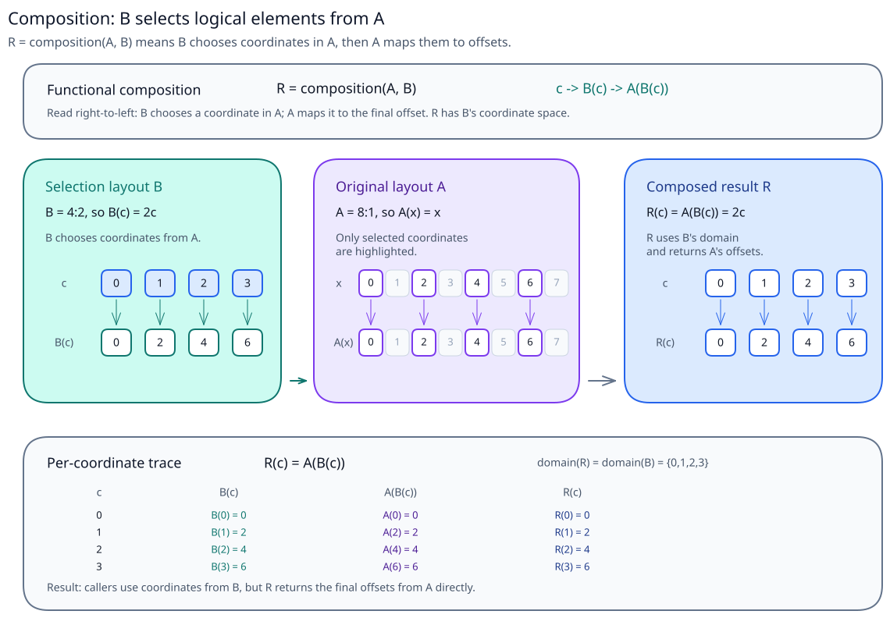

`B` selects coordinates `0, 2, 4, 6` from `A`. The composed layout maps the new 4-element view
directly to those original offsets:

```text
R(c) = A(B(c))
R    = 4:2
```

This pattern lets CuTe express slicing, selection, reordering, and views as layout operations.
That is why composition is one of the most fundamental layout algebra operations: many
higher-level operations are built on top of it.

### Complement

> **Use complement when** you have the layout of one tile and need to compute where repeated
> copies of that tile should start to cover a larger space.

`complement(B, N)` starts with two things:

```text
B = layout of one tile
N = total flattened space we want to cover
```

It returns another layout:

```text
C = complement(B, N)
```

`C` is the layout of the repetitions of `B`. In other words, `C(tile_id)` tells us where the
`tile_id`-th copy of `B` starts.

The useful question is:

```text
If B describes the coordinates inside one tile,
where do repeated copies of B need to start?
```

For example:

```text
B = 4:1
N = 16
```

`B` covers four contiguous positions:

```text
0, 1, 2, 3
```

To cover a 16-element space, we need repeated copies of that tile. Those copies start at:

```text
0, 4, 8, 12
```

So:

```text
complement(4:1, 16) = 4:4
```

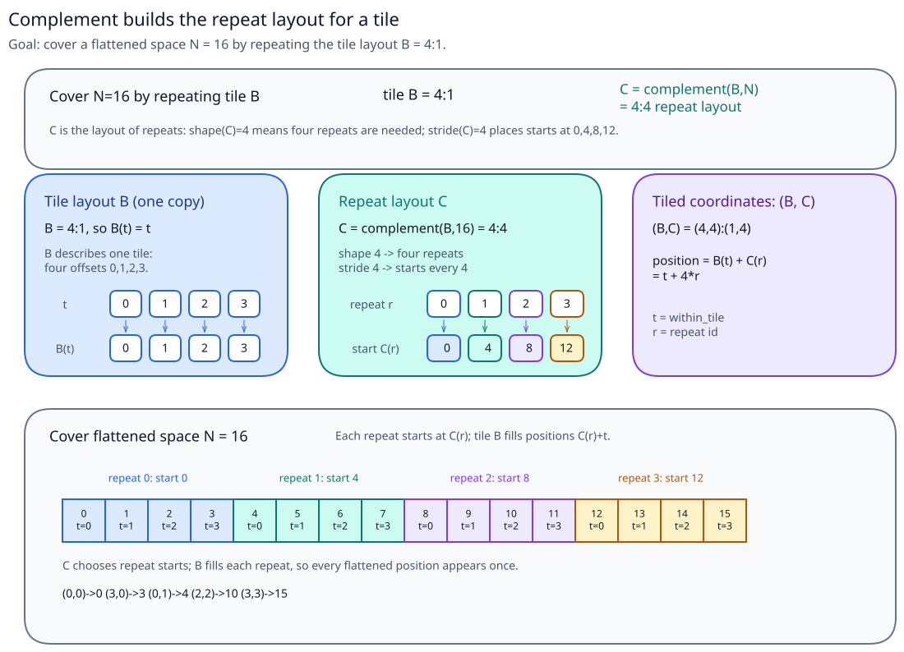

The complement is the missing coordinate structure that tells CuTe how the tile repeats. It
gives the "rest" mode.

Together, `(B, complement(B, N))` gives a tiled coordinate system:

```text
(within_tile, tile_id)
```

For this example:

```text
position = within_tile + 4 * tile_id
```

Mode 0, `B`, walks inside one tile. Mode 1, `complement(B, N)`, walks across the repeated tile
starts. This is why complement is the engine behind both divide and product: both need a way to
turn one tile layout into a larger tiled coordinate system.

### Divide

> **Use divide when** you want to reshape an existing larger layout into a tiled view: one
> mode says where you are within a tile, and another mode says which repeated tile you are in.

Divide is used when we want to view one layout as repeated tiles. This is how CuTe describes a
larger tensor using smaller tiles.

The most useful mental model is `zipped_divide`:

```text
zipped_divide(layout, tiler) -> ((tile modes...), (rest modes...))
```

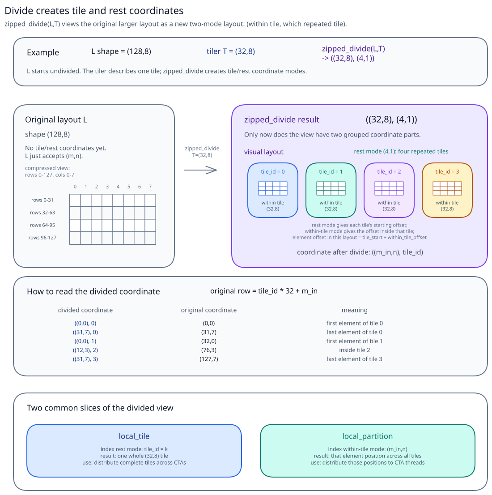

The result has two grouped parts:

```text
tile = coordinates inside one tile
rest = which repeated tile we are in
```

So if a layout has logical shape `(128,8)` and we divide it by a tiler `(32,8)`, the divided
view is conceptually:

```text
((32,8), (4,1))
```

Read that as:

```text
(coordinate inside a 32x8 tile, which of the 4 repeated tiles)
```

For a small 1-D version, dividing `16:1` by tile size `4` gives the full layout table:

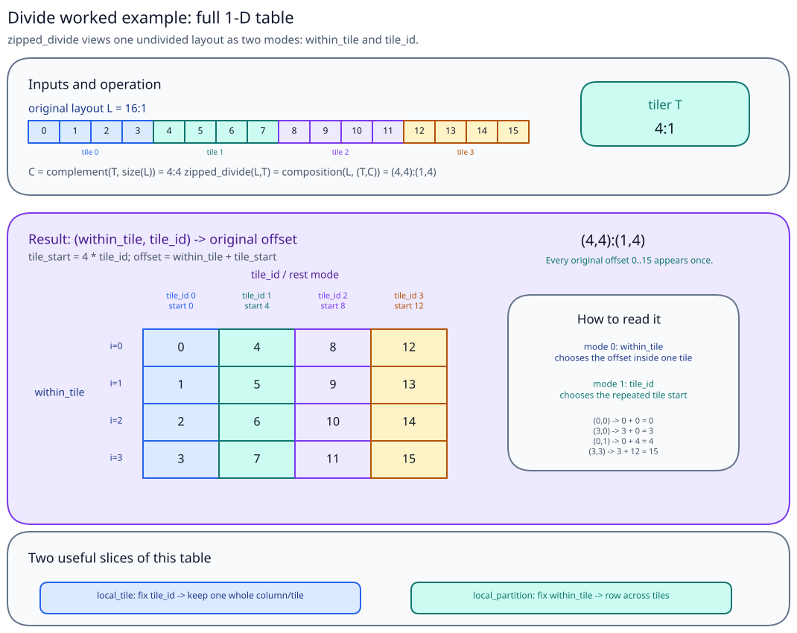

In that table, mode 0 (`within_tile`) gives the offset inside one tile. Mode 1 (`tile_id`)
chooses the start of the repeated tile.

This is the idea behind two common CuTe helpers:

```text
local_tile      -> slice the rest mode, keep one whole tile
local_partition -> slice the tile mode, keep one participant's elements across the rest
```

`local_tile` answers:

```text
Which whole tile does this tile coordinate select?
```

`local_partition` answers:

```text
Which elements does this thread / participant own?
```

They both start from the same divided view. They just slice opposite modes.

### Product

> **Use product when** you want to build a larger tiled layout from a smaller layout: one mode
> walks inside the smaller layout, and another mode chooses which repeated copy you are in.

`logical_product(A, B)` goes in the opposite direction from divide.

Divide starts with a larger layout and exposes it as:

```text
(inside one tile, which repeated tile)
```

Product starts with a smaller layout `A` and a layout `B` that describes which repetitions we
want. It builds the larger tiled layout:

```text
logical_product(A, B) = repeat layout A according to layout B
```

The operation has three conceptual steps:

```text
1. Build all repetition slots:
   A* = complement(A, size(A) * cosize(B))

2. Let B select the repetitions it wants:
   selected repetitions = composition(A*, B)

3. Combine the tile A with those selected repetitions:
   logical_product(A, B) = make_layout(A, selected repetitions)
```

Why `cosize(B)`? Because `B` selects repetitions using its output offsets. If `B` has gaps, its
largest output offset may be larger than `size(B)-1`, so the pool of available repetitions must
cover the full offset range that `B` can point into.

The next diagram shows the simple no-gap case: `A = 2:1` repeated by `B = 4:1`. Here
`size(B) == cosize(B)`, so every candidate repetition is used and the result is `(2,4):(1,2)`.

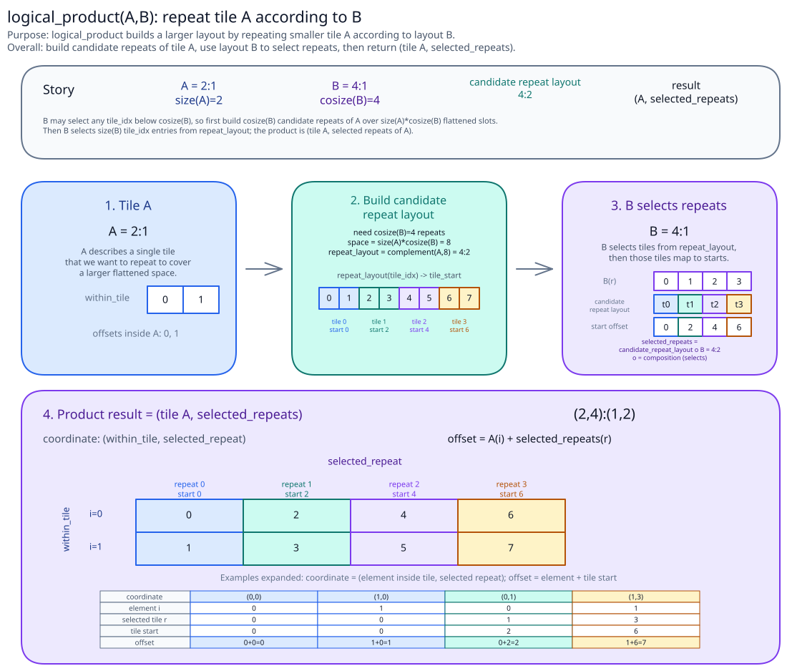

Now consider a gapped selector, where `B` skips some repetitions. For the example in the full
table below:

```text
A = 2:1
B = 4:2
size(B) = 4
cosize(B) = 7
```

we get:

```text
A* = complement(A, size(A) * cosize(B))
   = complement(2:1, 2 * 7)
   = complement(2:1, 14)
   = 7:2

selected repetitions = composition(A*, B)
                     = composition(7:2, 4:2)
                     = 4:4

logical_product(A, B) = (A, selected repetitions)
                      = (2,4):(1,4)
```

The full gapped result is:

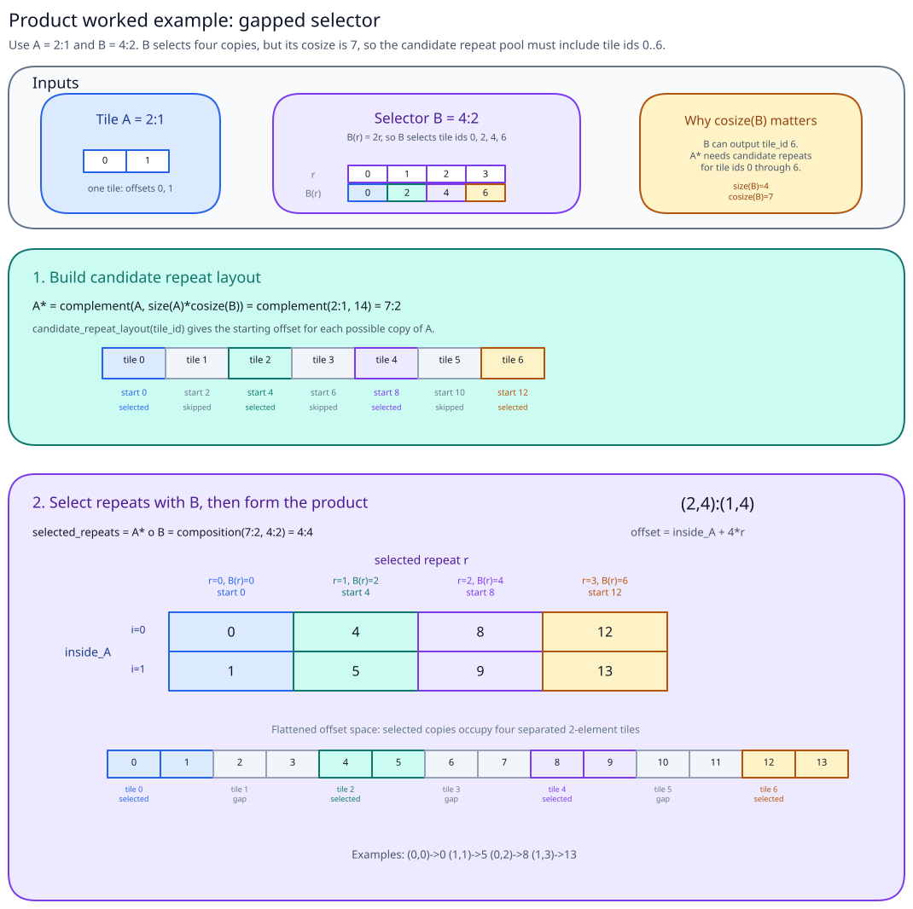

In that table, mode 0 (`inside_A`) walks inside one copy of `A`. Mode 1 (`selected repeat r`)
chooses one of the repetitions selected by `B`. Since `B=4:2` produces tile ids `0,2,4,6`,
the selected copy starts are `0,4,8,12`, leaving gaps between the produced offsets.

The product result has two conceptual parts:

```text
(coordinate inside A, which repetition B selected)
```

This is why layout algebra is the foundation for tiling and partitioning. It lets CuTe express
new coordinate systems without manually writing indexing code for every tile, thread, or
fragment view.

---

## Summary

- A CuTe `Layout` is `shape:stride`: shape defines the logical coordinate space, and stride maps coordinates to linear offsets.
- Layout evaluation is a two-step process: compatible input coordinate -> natural coordinate using the shape -> linear offset using the stride.
- `size` counts logical elements; `cosize` tells how many linear offset positions the layout consumes, including gaps.
- Nested shapes preserve useful factorization, so layouts can describe tiled and hierarchical coordinate spaces.
- Layout algebra treats layouts as functions and builds new layouts through composition, complement, divide, and product.
- Composition builds views, complement creates repetition/rest layouts, divide exposes `(tile, rest)`, and product builds larger tiled layouts from smaller ones.
